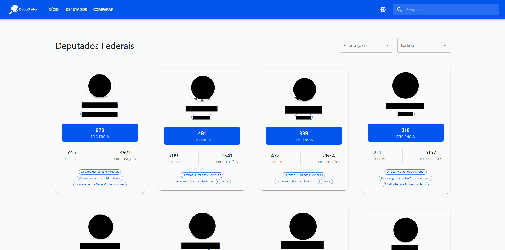
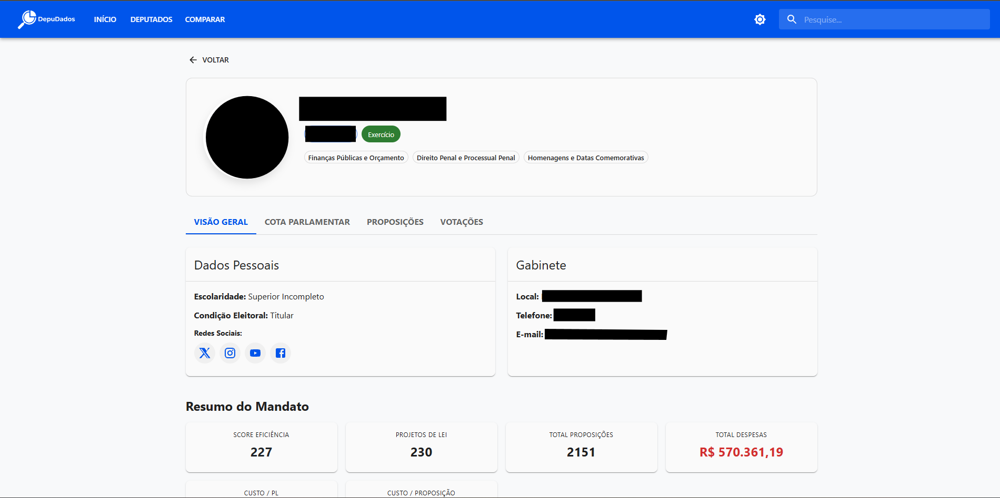
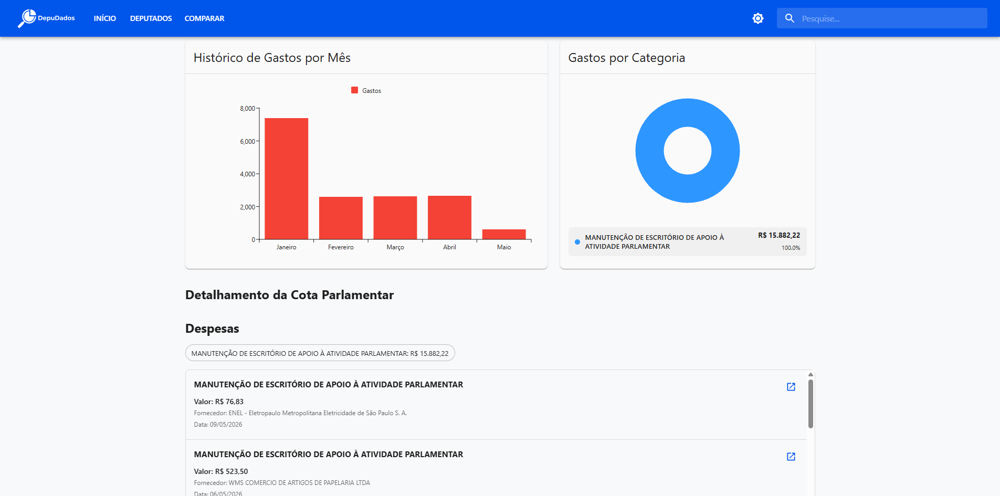
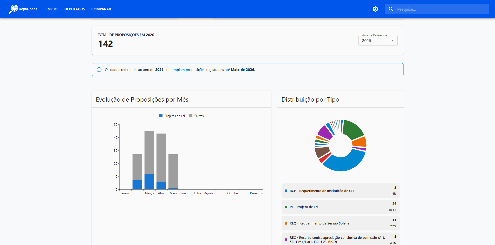
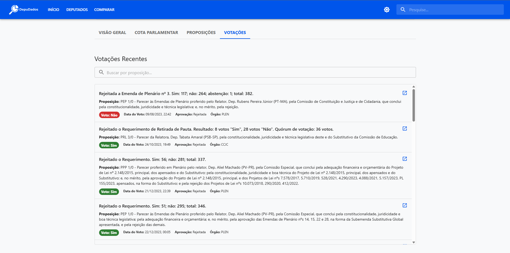
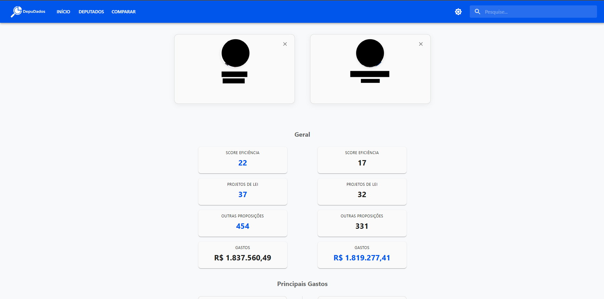

# 🏛️ Depudados - Frontend

> Plataforma web para exploração, visualização e transparência de dados abertos da Câmara dos Deputados do Brasil.

[](https://depudados.web.app/)
[](https://react.dev/)
[](https://www.typescriptlang.org/)
[](https://vite.dev/)
[](https://mui.com/)

---

## 🌐 Localização em Produção

A aplicação está implantada e disponível publicamente no Firebase Hosting:

🔗 **[https://depudados.web.app/](https://depudados.web.app/)**

> **Contexto Acadêmico:** Projeto desenvolvido no âmbito da disciplina de **Programação para Internet e Web (PIW)** do curso de Engenharia de Software da **Universidade Federal do Ceará (UFC)**.

---

## 📑 Funcionalidades Principais

- **📊 Página Inicial (`/`):**
  - Apresentação do intuito do projeto e dos dados que serão disponibilizados.

  

- **🔍 Consulta e Filtragem de Deputados (`/deputados`):**
  - Busca textual por nome do parlamentar.
  - Filtros combinados por Unidade Federativa (UF) e sigla partidária.
  - **Paginação** para renderização fluida e performática de centenas de registros.

  
  

- **👤 Perfil Detalhado do Deputado (`/deputado/:id`):**
  - Dados biográficos, gabinete, partido e estado de representação.
  - Estátisticas gerais de proposições, gastos, presenças e temas de atuação.
  
  
  
  - **Aba de Despesas:** gráficos interativos de gastos mensais e detalhamento por tipo de despesa via `@mui/x-charts`.

  

  - **Aba de Proposições:** tramitações, ementas e projetos de lei apresentados pelo parlamentar.

  

  - **Aba de Votações:** registro histórico de participação e posicionamentos em plenário.

  


- **⚖️ Comparador Parlamentar (`/comparar`):**
  - Comparação lado a lado de gastos, presenças e votações entre diferentes parlamentares.
  
  

---

## 🛠️ Tecnologias Utilizadas

| Categoria | Tecnologia | Finalidade |
| :--- | :--- | :--- |
| **Core** | [React 19](https://react.dev/) | Biblioteca base para construção da interface de usuário |
| **Linguagem** | [TypeScript](https://www.typescriptlang.org/) | Tipagem estática, contratos de interfaces e segurança de código |
| **Build & Bundler** | [Vite](https://vite.dev/) | Bundler moderno com Hot Module Replacement (HMR) ultrarrápido |
| **Roteamento** | [React Router v7](https://reactrouter.com/) | Roteamento declarativo no cliente (SPA) |
| **Design System** | [Material UI (MUI)](https://mui.com/) | Componentes visuais acessíveis e consistentes |
| **Estilização** | [Emotion](https://emotion.sh/) | Motor de CSS-in-JS que alimenta o Material UI |
| **Visualização de Dados** | [@mui/x-charts](https://mui.com/x/react-charts/) | Gráficos responsivos de barras, linhas e séries temporais |
| **Performance** | [@tanstack/react-virtual](https://tanstack.com/virtual) | Virtualização de listas longas para economia de memória no DOM |
| **Comunicação HTTP** | [Axios](https://axios-http.com/) | Cliente HTTP para consumo da API REST do backend |
| **Hospedagem & Analytics** | [Firebase Hosting / Analytics](https://firebase.google.com/) | Infraestrutura de entrega contínua em nuvem e métricas |
| **Qualidade de Código** | [ESLint](https://eslint.org/) + [Prettier](https://prettier.io/) | Padronização de estilo, regras estáticas e formatação automática |

---

## 📐 Práticas de Código e Padrões Arquiteturais

O projeto adota padrões modernos de engenharia de software para garantir manutenibilidade, legibilidade e performance:

1. **Clean Code & Princípios SOLID:**
   - **Responsabilidade Única (SRP):** componentes visuais são desacoplados das regras de acesso à rede e de gerenciamento de estado complexo.
   - **Camada de Serviços Dedicada:** classes e módulos em `src/services/` (como `DepudadosAPI`) centralizam chamadas à API, tratamento de parâmetros e normalização de erros.
2. **Estilo Funcional e Previsível:**
   - Preferência estrita por `const` em detrimento de `let` ou `var`.
   - Utilização consistente de **arrow functions**.
   - Priorização de funções puras e transformações imutáveis de dados sempre que viável.
   - Implementação direta e imperativa nas rotinas de processamento de dados e cálculo de métricas.
3. **Tipagem Estrita e Contratos Consistentes:**
   - Modelos TypeScript centralizados em `src/types/`.
   - Padronização de paginação e respostas através do tipo genérico `PagedResponse<T>`, alinhado com o backend.
4. **Performance e Virtualização de Listas:**
   - Uso de virtualização com `@tanstack/react-virtual` para renderizar apenas os elementos visíveis na viewport, reduzindo significativamente o consumo de nós do DOM.
5. **Padronização e Linting:**
   - Configuração moderna do ESLint (`eslint.config.js` flat config) com `@typescript-eslint` e `eslint-plugin-react-hooks`.
   - Formatação consistente via Prettier (`.prettierrc`).

---

## 📂 Estrutura do Projeto

```text
frontend-projeto-depudados/
├── public/                 # Favicon, assets estáticos e manifesto
├── src/
│   ├── assets/             # Mídias e imagens compiladas
│   ├── components/         # Componentes compartilhados e atômicos (NavBar, Footer, Cards)
│   ├── config/             # Configurações de serviços externos (Firebase)
│   ├── hooks/              # Custom hooks para lógica reutilizável
│   ├── layouts/            # Layouts estruturais da aplicação (RootLayout)
│   ├── pages/              # Páginas e telas da aplicação
│   │   ├── ComparacaoDeputados/  # Tela de comparação entre parlamentares
│   │   ├── DeputadoDetalhes/     # Perfil e abas de despesas, proposições e presenças
│   │   ├── Deputados.tsx         # Listagem e busca com virtualização
│   │   └── Home.tsx              # Dashboard inicial
│   ├── routes/             # Definição do roteamento via React Router
│   ├── services/           # Clientes HTTP (DepudadosAPI, PartidosAPI)
│   ├── theme/              # Customização de temas e tipografia MUI
│   ├── types/              # Definições de tipos e interfaces TypeScript
│   ├── utils/              # Funções utilitárias e formatadores
│   ├── App.tsx             # Componente raiz
│   └── main.tsx            # Ponto de inicialização do React
├── .env.example            # Modelo de variáveis de ambiente
├── eslint.config.js        # Configuração do ESLint
├── firebase.json           # Configuração de deploy e rewrites do Firebase Hosting
├── package.json            # Metadados e dependências
├── tsconfig.app.json       # Configuração do compilador TypeScript para a aplicação
└── vite.config.ts          # Configuração do bundler Vite
```

---

## 🚀 Como Executar Localmente

### Pré-requisitos

- **Node.js** (versão 18 ou superior recomendada)
- Gerenciador de pacotes **npm**

### Passo a Passo

1. **Clone o repositório e acesse a pasta do frontend:**
   ```bash
   cd frontend-projeto-depudados
   ```

2. **Configure as variáveis de ambiente:**
   Crie um arquivo `.env` na raiz da pasta `frontend-projeto-depudados` com base no `.env.example`:
   ```bash
   cp .env.example .env
   ```
   Preencha as credenciais do Firebase caso deseje utilizar o Firebase Analytics:
   ```env
   VITE_FIREBASE_API_KEY=sua_api_key
   VITE_FIREBASE_AUTH_DOMAIN=seu_auth_domain
   VITE_FIREBASE_PROJECT_ID=seu_project_id
   VITE_FIREBASE_STORAGE_BUCKET=seu_storage_bucket
   VITE_FIREBASE_MESSAGING_SENDER_ID=seu_sender_id
   VITE_FIREBASE_APP_ID=seu_app_id
   VITE_FIREBASE_MEASUREMENT_ID=seu_measurement_id
   ```

3. **Instale as dependências:**
   ```bash
   npm install
   ```

4. **Inicie o servidor de desenvolvimento:**
   ```bash
   npm run dev
   ```
   A aplicação estará disponível em `http://localhost:5173`.

---

## 📜 Scripts Disponíveis

- `npm run dev`: Inicia o servidor local de desenvolvimento com HMR.
- `npm run build`: Valida os tipos com o compilador TypeScript e gera o bundle de produção na pasta `dist/`.
- `npm run preview`: Executa localmente o bundle compilado para verificação antes do deploy.
- `npm run lint`: Executa a análise estática de código com o ESLint.

---

## ☁️ Deploy e Integração com o Backend

- **Hospedagem Frontend:** O deploy é realizado no **Firebase Hosting** a partir da pasta `dist/`. O arquivo `firebase.json` inclui configuração de *rewrites* para suportar rotas de SPA no cliente:
  ```json
  "rewrites": [
    {
      "source": "**",
      "destination": "/index.html"
    }
  ]
  ```
- **Backend Conectado:**
  - Em desenvolvimento: aponta para `http://localhost:3001` (quando `VITE_ENV=development`).
  - Backend para desenvolvimento encontra-se no repositório [backend-projeto-depudados](https://github.com/LucasLevyOB/backend-projeto-depudados).
  - Em produção: consome a API do backend hospedada em [https://backend-projeto-depudados.onrender.com](https://backend-projeto-depudados.onrender.com).
